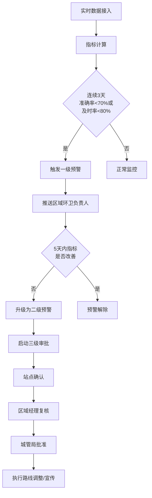

## 1. 产品概述

全国性垃圾分类与资源化处理监测分析平台，旨在通过实时接入多源IoT数据（垃圾桶满溢传感器、转运车GPS、处理厂入料产出），构建全国统一的垃圾分类运营监控体系，提供数据驱动的智能决策支持。目标用户包括国家住建部、省级环卫主管部门、市级城管局及区域环卫负责人。

- 解决垃圾分类监管难、数据分散、预警滞后、资源调配不科学等痛点
- 实现全国34个省级行政区、300+地级市的垃圾分类全链路可视化监控与智能预警

## 2. 核心功能

### 2.1 用户角色

| 角色 | 注册方式 | 核心权限 |
|------|----------|----------|
| 国家级管理员 | 系统预置 | 查看全国数据、审批重大调整、发布全国性指令 |
| 省级管理员 | 上级分配 | 查看省内所有城市数据、审批省内路线调整 |
| 市级管理员 | 上级分配 | 查看本市数据、审批路线调整、发布宣传方案 |
| 区域环卫负责人 | 上级分配 | 负责区域日常运营、接收预警、确认站点状态 |

### 2.2 功能模块

1. **核心数据看板**：全国热力图、资源化率排名、关键指标总览、城市/类型切换
2. **实时监控中心**：垃圾桶满溢监控、转运车实时轨迹、处理厂运行状态
3. **智能预警系统**：一级/二级预警自动触发、三级审批流程、预警推送
4. **区域下钻分析**：7天收运趋势、分类组成分布、站点明细
5. **宣传方案管理**：Excel方案上传、关键要素自动提取、优化建议
6. **产量预测中心**：未来7天垃圾产生量预测、处理能力预警、收运频次推荐
7. **运营诊断报告**：周报自动生成、同比环比分析、成本趋势、优化建议
8. **权限管理中心**：三级权限分配、数据范围控制、操作审计

### 2.3 页面详情

| 页面名称 | 模块名称 | 功能描述 |
|----------|----------|----------|
| 登录页 | 身份认证 | 账号密码登录、三级角色选择、数据范围预览 |
| 全国总览看板 | 指标总览卡 | 分类准确率、清运及时率、资源化转化率实时展示 |
| 全国总览看板 | 清运热力图 | 按省份/城市展示垃圾清运量密度、支持缩放交互 |
| 全国总览看板 | 资源化率排名 | 全国各省市资源化率TOP10/倒数10排行 |
| 全国总览看板 | 预警概览 | 当前活跃预警数、一级/二级预警分布 |
| 区域监控中心 | 实时指标监控 | 分区域展示分类准确率、清运及时率趋势 |
| 区域监控中心 | 垃圾桶状态 | 满溢/正常/异常状态列表、地图分布 |
| 区域监控中心 | 转运车监控 | GPS实时轨迹、当前位置、装载状态、预计到达 |
| 区域监控中心 | 处理厂监控 | 入料量、产出量、资源化率、运行负荷率 |
| 区域下钻详情 | 7天收运趋势 | 折线图展示近7天各垃圾站收运量变化 |
| 区域下钻详情 | 分类组成分布 | 饼图/环形图展示可回收/厨余/有害/其他占比 |
| 区域下钻详情 | 站点明细列表 | 各站点收运频次、准确率、异常记录 |
| 智能预警中心 | 预警列表 | 一级/二级预警、状态筛选、时间筛选 |
| 智能预警中心 | 三级审批流程 | 站点确认→区域经理复核→城管局批准 |
| 智能预警中心 | 预警推送记录 | 推送时间、接收人、确认状态 |
| 宣传方案管理 | Excel上传 | 拖拽上传、格式校验、自动提取关键要素 |
| 宣传方案管理 | 方案预览 | 提取的宣传范围、时间、人群、预算展示 |
| 产量预测中心 | 7天预测曲线 | 分类型展示未来7天垃圾产生量预测 |
| 产量预测中心 | 处理能力预警 | 超出处理能力的日期与超出量标注 |
| 产量预测中心 | 优化推荐 | 收运频次调整、增开处理线建议 |
| 运营诊断报告 | 周报列表 | 按周生成、支持下载PDF |
| 运营诊断报告 | 指标对比 | 同比环比变化、趋势图 |
| 运营诊断报告 | 成本分析 | 清运成本趋势、单位处理成本 |
| 运营诊断报告 | 优化建议 | 推荐收运路线调整、宣传重点区域 |
| 权限管理中心 | 用户列表 | 三级用户管理、角色分配 |
| 权限管理中心 | 数据范围配置 | 各用户可查看的行政区域配置 |

## 3. 核心流程

### 3.1 预警触发与处理流程

用户登录系统后，系统后台实时监控各区域指标。当连续3天分类准确率低于70%或清运及时率低于80%时，自动触发一级预警并推送至区域环卫负责人。区域负责人确认后，若5天内指标仍未改善，系统自动升级为二级预警，启动三级审批流程（站点确认→区域经理复核→城管局批准），审批通过后执行收运路线调整或宣传活动。

### 3.2 宣传方案上传与预测流程

## 4. 用户界面设计

### 4.1 设计风格

- **主色调**：深绿-墨绿渐变（#0F4C3A → #1A5F4A），体现环保主题
- **辅助色**：活力橙（#FF6B35）用于预警与强调；数据蓝（#2D6CDF）用于图表
- **中性色**：深色背景（#0A1612）+ 半透明卡片 + 白色文字，打造政务级数据大屏感
- **按钮风格**：圆角8px，主色渐变填充，悬停有微光动画
- **字体**：标题使用思源黑体 Bold；正文使用思源黑体 Regular；数字使用等宽字体 JetBrains Mono
- **布局风格**：卡片式模块化布局，顶部导航栏+侧边功能栏+主内容区
- **图标风格**：Lucide 线性图标，统一24px尺寸，配合主题色

### 4.2 页面设计概览

| 页面名称 | 模块名称 | UI元素 |
|----------|----------|--------|
| 登录页 | 身份认证 | 玻璃拟态登录卡、垃圾分类图标装饰、动态背景粒子 |
| 全国总览看板 | 指标总览卡 | 4张渐变背景KPI卡、数字跳动动画、环比小箭头 |
| 全国总览看板 | 清运热力图 | 中国地图SVG、省份颜色深浅映射清运量、悬停弹窗 |
| 全国总览看板 | 资源化率排名 | 横向条形图、颜色渐变、滚动动画 |
| 区域监控中心 | 实时指标监控 | 多折线趋势图、阈值线标注、区域Tab切换 |
| 区域监控中心 | 垃圾桶状态 | 卡片网格、状态颜色标识（绿/黄/红）、实时更新动画 |
| 智能预警中心 | 预警列表 | 表格行高亮、预警等级徽章、倒计时显示、审批进度条 |
| 产量预测中心 | 7天预测曲线 | 面积图、预测区间阴影、超阈值区域红色标注 |
| 运营诊断报告 | 周报内容 | 双栏布局、图表+文字分析、可下载按钮 |

### 4.3 响应式

- Desktop-first 设计，主分辨率适配 1920×1080 及以上
- 侧边栏在 1366px 以下自动收起为图标模式
- 热力图在平板端简化交互，保留核心数据展示
- 所有表格支持横向滚动，确保小屏可读

### 4.4 3D场景指引

- 不使用3D场景，专注2D数据可视化的深度与精度
- 热力图通过多层SVG叠加与渐变制造深度感
- 卡片通过多层阴影与微妙位移营造悬浮层次感
