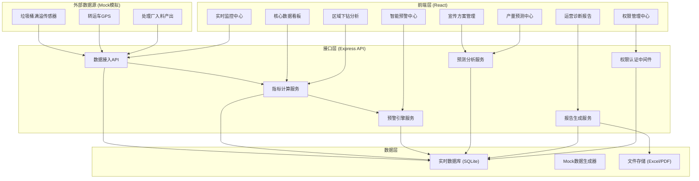
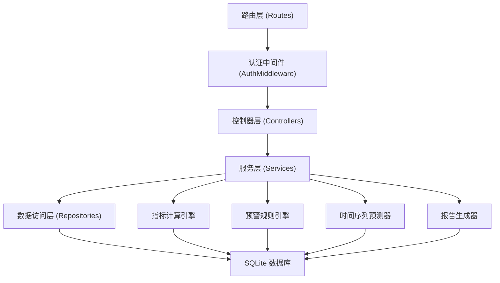
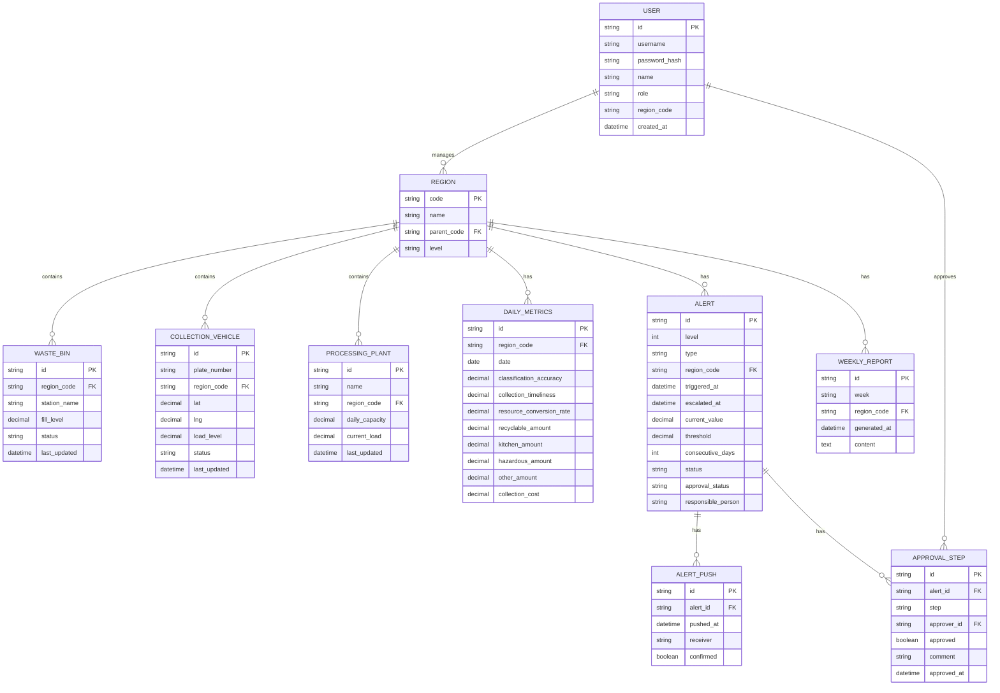

## 1. 架构设计



## 2. 技术描述

- **前端框架**：React@18 + TypeScript + Vite
- **状态管理**：Zustand（全局状态：用户权限、筛选条件、预警通知）
- **UI 样式**：TailwindCSS@3 + 自定义主题配色
- **图表库**：Recharts（折线图、饼图、条形图、面积图）
- **地图可视化**：ECharts（中国地图热力图）
- **图标库**：Lucide React
- **Excel处理**：SheetJS (xlsx)
- **后端框架**：Express@4 + TypeScript + ESM
- **数据库**：SQLite（本地开发，使用mock数据模拟）
- **初始化工具**：vite-init

## 3. 路由定义

| 路由 | 页面组件 | 权限级别 | 用途 |
|------|----------|----------|------|
| /login | Login | 公开 | 登录认证 |
| /dashboard | Dashboard | 所有角色 | 全国总览看板 |
| /monitor | Monitor | 所有角色 | 实时监控中心 |
| /monitor/region/:id | RegionDetail | 所有角色 | 区域下钻详情 |
| /alerts | Alerts | 所有角色 | 智能预警中心 |
| /alerts/:id/approval | ApprovalFlow | 市级+ | 三级审批流程 |
| /campaign | Campaign | 市级+ | 宣传方案管理 |
| /forecast | Forecast | 所有角色 | 产量预测中心 |
| /reports | Reports | 所有角色 | 运营诊断报告 |
| /admin/users | UserAdmin | 省级+ | 用户与权限管理 |

## 4. API定义

### 4.1 认证接口

```typescript
// POST /api/auth/login
interface LoginRequest {
  username: string;
  password: string;
}
interface LoginResponse {
  token: string;
  user: {
    id: string;
    name: string;
    role: 'national' | 'provincial' | 'municipal' | 'regional';
    regionCode: string;
    regionName: string;
  };
}
```

### 4.2 指标数据接口

```typescript
// GET /api/metrics/overview
interface MetricsOverview {
  classificationAccuracy: number;
  collectionTimeliness: number;
  resourceConversionRate: number;
  totalWasteCollected: number;
  alertsActive: number;
  alertsLevel1: number;
  alertsLevel2: number;
  comparedYesterday: {
    classificationAccuracy: number;
    collectionTimeliness: number;
    resourceConversionRate: number;
    totalWasteCollected: number;
  };
}

// GET /api/metrics/region?regionCode=&type=
interface RegionMetrics {
  regionCode: string;
  regionName: string;
  dailyData: {
    date: string;
    classificationAccuracy: number;
    collectionTimeliness: number;
    resourceConversionRate: number;
    wasteByType: { recyclable: number; kitchen: number; hazardous: number; other: number };
  }[];
}
```

### 4.3 热力图接口

```typescript
// GET /api/heatmap?level=province|city
interface HeatmapItem {
  code: string;
  name: string;
  value: number;
  accuracy: number;
  timeliness: number;
  resourceRate: number;
}
```

### 4.4 预警接口

```typescript
// GET /api/alerts?status=&level=&regionCode=
interface Alert {
  id: string;
  level: 1 | 2;
  type: 'accuracy' | 'timeliness';
  regionCode: string;
  regionName: string;
  triggeredAt: string;
  escalatedAt?: string;
  currentValue: number;
  threshold: number;
  consecutiveDays: number;
  status: 'active' | 'processing' | 'resolved' | 'escalated';
  approvalStatus?: 'pending_station' | 'pending_manager' | 'pending_bureau' | 'approved' | 'rejected';
  responsiblePerson: string;
  pushRecords: { pushedAt: string; receiver: string; confirmed: boolean }[];
}

// POST /api/alerts/:id/approve
interface ApprovalRequest {
  step: 'station' | 'manager' | 'bureau';
  approved: boolean;
  comment: string;
  actionPlan?: string;
}
```

### 4.5 预测接口

```typescript
// POST /api/forecast/upload
// Content-Type: multipart/form-data
// Body: Excel file
interface ForecastResult {
  extractedPlan: {
    campaignName: string;
    targetRegion: string;
    startDate: string;
    endDate: string;
    targetPopulation: number;
    budget: number;
    keyActions: string[];
  };
  prediction: {
    date: string;
    recyclable: number;
    kitchen: number;
    hazardous: number;
    other: number;
    total: number;
    processingCapacity: number;
    exceedsCapacity: boolean;
  }[];
  recommendations: {
    type: 'frequency' | 'line';
    description: string;
    affectedStations?: string[];
  }[];
}
```

### 4.6 报告接口

```typescript
// GET /api/reports?week=&regionCode=
interface WeeklyReport {
  week: string;
  startDate: string;
  endDate: string;
  metrics: {
    classificationAccuracy: { current: number; yoy: number; mom: number };
    collectionTimeliness: { current: number; yoy: number; mom: number };
    resourceConversionRate: { current: number; yoy: number; mom: number };
  };
  costAnalysis: {
    weeklyTotal: number;
    unitCost: number;
    trend: { date: string; cost: number }[];
  };
  recommendations: {
    routeOptimization: { region: string; suggestion: string }[];
    publicityFocus: { region: string; focus: string }[];
  };
}
```

## 5. 服务端架构图



## 6. 数据模型

### 6.1 ER图



### 6.2 核心Mock数据说明

系统内置完整Mock数据，覆盖：
- 全国34个省级行政区、100+地级市的区域层级关系
- 各区域每日分类准确率、清运及时率、资源化转化率（近30天历史+实时模拟）
- 200+垃圾桶传感器实时状态（满溢度0-100%）
- 50+转运车GPS位置实时更新
- 30+处理厂入料产出数据
- 预警与审批流程完整测试数据
- 每周运营诊断报告预生成数据
